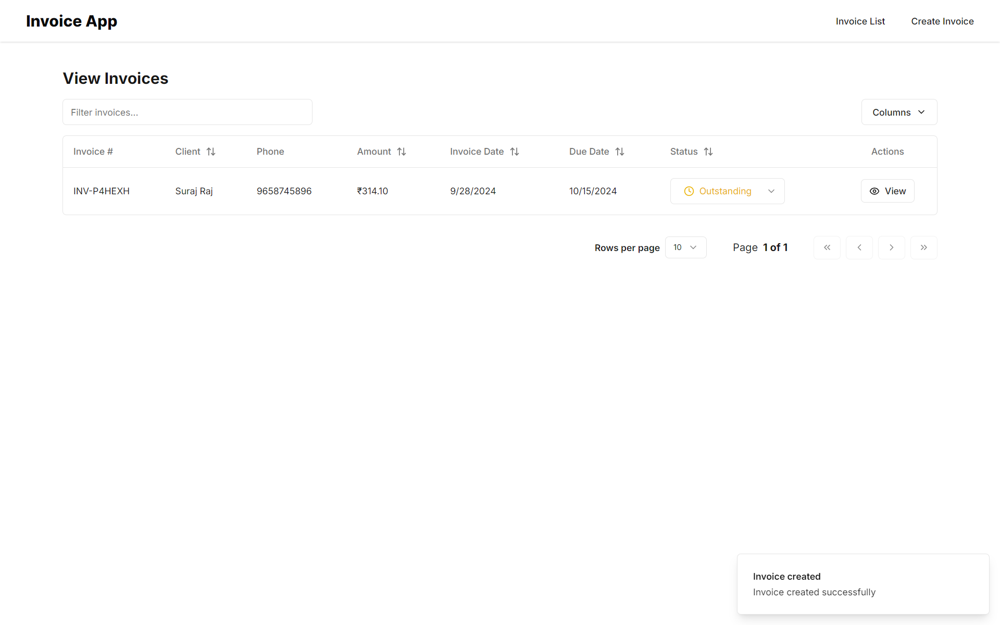
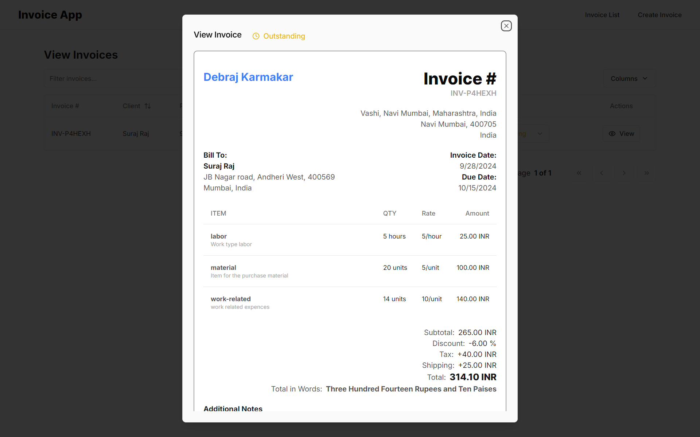
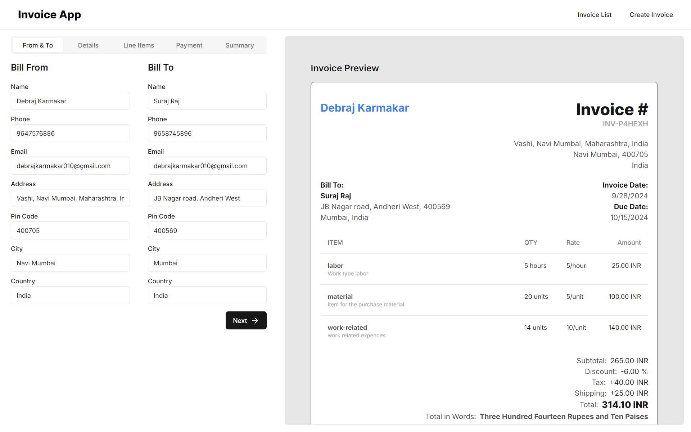
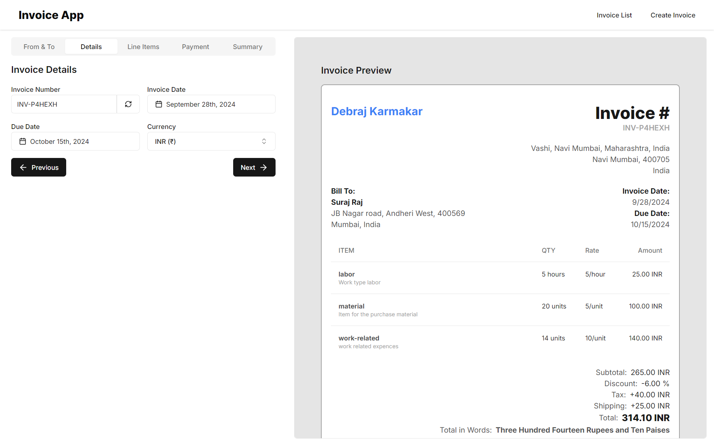
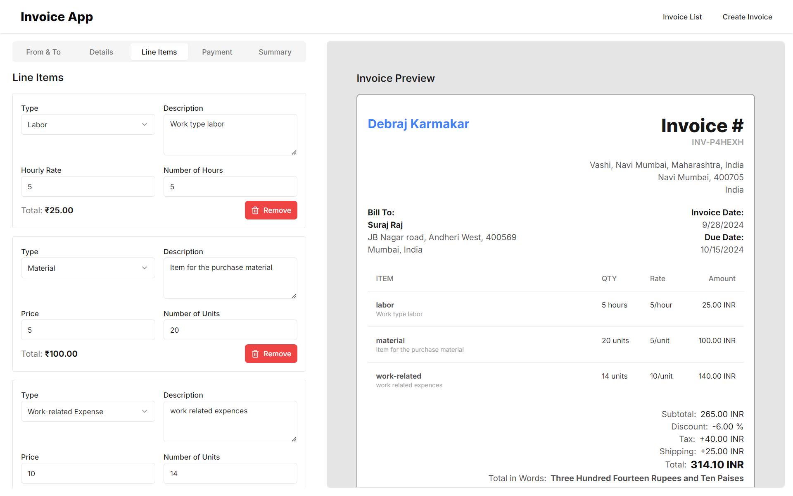
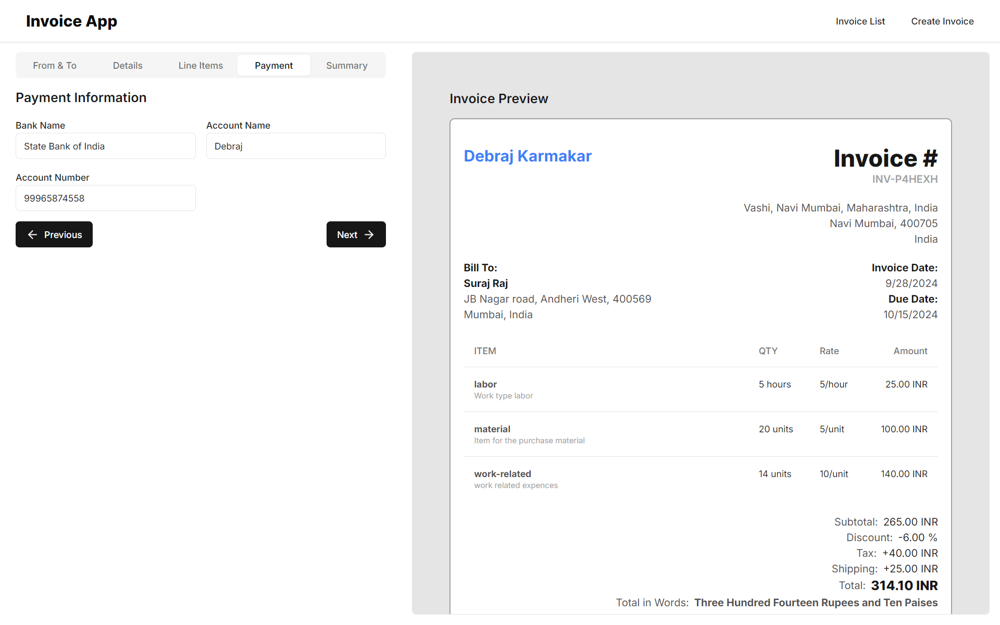
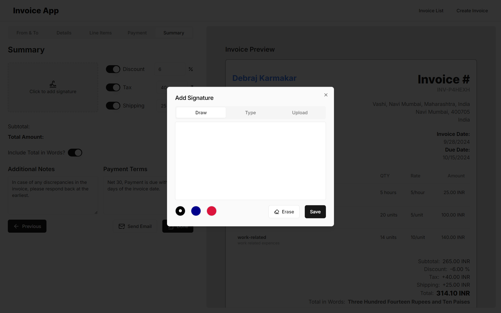
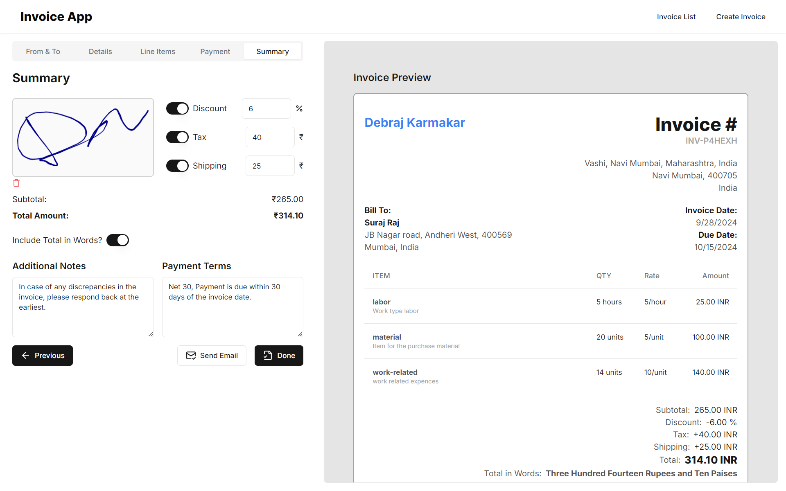
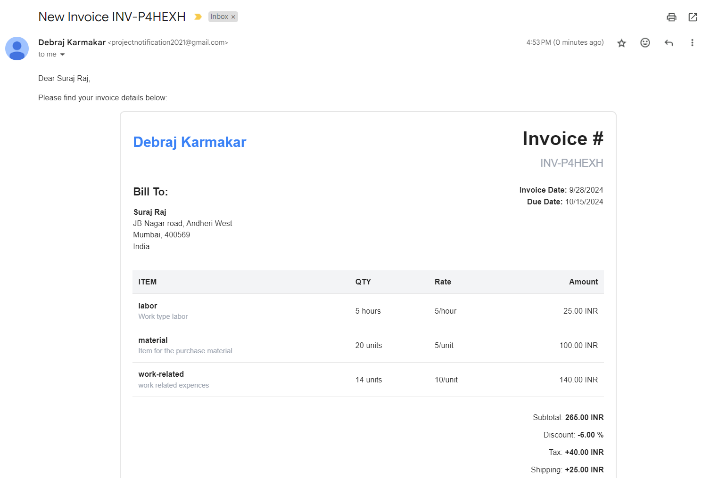
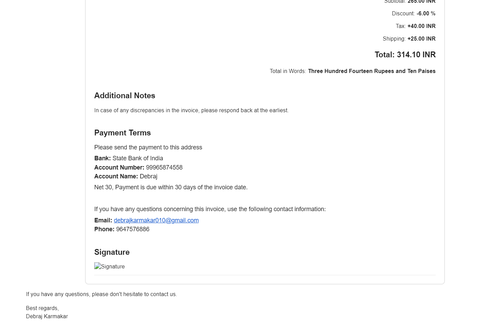

# Invoice App

The Invoice App is a comprehensive, React-based web application designed for creating, managing, and sending professional invoices. It offers a user-friendly interface with real-time preview, detailed line item management, and direct email integration for efficient invoice handling.

🌐 Website: [Invoice App](https://invoice-app-vite.vercel.app/)

## UI

<p align="center">
  
  
  
  
  
  
  
  
  
  
  </p>
</p>

## Features

- **Create and Edit Invoices**: Dynamic form with real-time preview
- **Line Item Management**: Add, edit, and remove line items with automatic total calculation
- **Currency Support**: Multiple currency options with proper formatting
- **Tax and Discount**: Apply tax and discounts to invoices
- **Payment Terms**: Add custom payment terms to invoices
- **Signature**: Draw, type, or upload signatures
- **Email Integration**: Send invoices directly via email using EmailJS
- **Invoice Status**: Track invoice status (outstanding, paid, late)
- **Responsive Design**: Mobile-friendly interface
- **Data Persistence**: Store invoices using Zustand for state management

## Technologies Used

- React
- TypeScript
- Zustand (State Management)
- React Router (Navigation)
- Tailwind CSS (Styling)
- EmailJS (Email Integration)
- React Signature Canvas (Signature Functionality)
- date-fns (Date Formatting)
- Vite (Build Tool)

## Getting Started

### Prerequisites

- Node.js (v14 or later)
- npm or yarn
- Git

### Installation

1. Clone the repository:
   ```
   git clone https://github.com/yourusername/invoice-app.git
   ```

2. Navigate to the project directory:
   ```
   cd invoice-app
   ```

3. Install dependencies:
   ```
   npm install
   ```

4. Create a `.env.local` file in the root directory and add your EmailJS credentials:
   ```
   VITE_EMAIL_JS_SERVICE_ID=your_service_id
   VITE_EMAIL_JS_TEMPLATE_ID=your_template_id
   VITE_EMAIL_JS_USER_ID=your_user_id
   ```

### Running Locally

1. Start the development server:
   ```
   npm run dev
   ```

2. Open `http://localhost:4000` in your browser to view the application.

3. To build the app for production:
   ```
   npm run build
   ```

4. To preview the production build:
   ```
   npm run preview
   ```

5. To run linting:
   ```
   npm run lint
   ```

## Project Structure

```
src/
├── app/
│   └── App.tsx
├── components/
│   ├── Badge/
│   ├── Form/
│   ├── Header/
│   ├── Modal/
│   ├── Preview/
│   ├── Sidebar/
│   ├── Stepper/
│   └── Table/
├── constants/
│   ├── columns.tsx
│   ├── currencies.ts
│   └── defaultInvoice.ts
├── hooks/
│   └── useDynamicFontSize.ts
|   └── useInvoiceCalculations.ts
├── lib/
│   └── sendInvoiceEmail.ts
├── pages/
│   ├── CreateInvoice/
│   └── ViewInvoices/
├── store/
│   └── invoiceStore.ts
└── utils/
    └── index.ts
```

## Key Components

- **CreateInvoice**: Main component for creating and editing invoices
- **Preview**: Renders a real-time preview of the current invoice
- **Sidebar**: Contains form inputs for invoice details
- **ViewInvoices**: Displays a list of all invoices with sorting and filtering options
- **DataTable**: Reusable table component for displaying invoice data

## State Management

The application uses Zustand for state management. The main store is defined in `src/store/invoiceStore.ts` and includes actions for creating, updating, and managing invoices.

## Email Functionality

The app uses EmailJS for sending invoices directly via email. Here's how it works:

1. Set up EmailJS account and obtain credentials (Service ID, Template ID, User ID).
2. Store credentials in `.env.local` file.
3. Use the `sendInvoiceEmail` function in `src/lib/sendInvoiceEmail.ts`:

```typescript
export async function sendInvoiceEmail(invoice: InvoiceFormValues, htmlContent: string): Promise<void> {
  // EmailJS configuration and sending logic
}
```

4. Call this function when sending an invoice:

```typescript
const htmlContent = renderToStaticMarkup(<EmailPreview currentInvoice={currentInvoice} />);
await sendInvoiceEmail(currentInvoice, htmlContent);
```

The email content is generated using the `EmailPreview` component, which creates an HTML representation of the invoice.

## Customization

- **Currencies**: Add or modify currencies in `src/constants/currencies.ts`
- **Invoice Template**: Customize the invoice layout in the `Preview` component
- **Styling**: Modify the Tailwind CSS classes or update `tailwind.config.js` for global style changes

## License

This project is licensed under the MIT License.